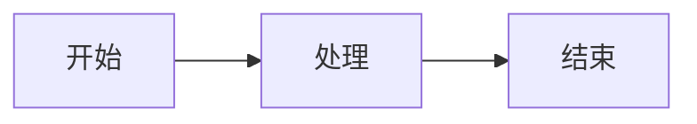

# Blog

一个基于 SvelteKit 构建的现代博客系统，集成了封面制作、隐藏图生成、友链管理等实用工具。支持静态站点生成与多平台部署。

## 目录

- [技术栈](#技术栈)
- [功能概览](#功能概览)
- [环境要求](#环境要求)
- [快速开始](#快速开始)
- [可用命令](#可用命令)
- [项目结构](#项目结构)
- [站点配置](#站点配置)
- [统计分析](#统计分析)
- [写文章](#写文章)
- [添加友链](#添加友链)
- [封面制作](#封面制作)
- [隐藏图](#隐藏图)
- [主题系统](#主题系统)
- [图片优化](#图片优化)
- [代码块](#代码块)
- [Markdown 扩展](#markdown-扩展)
- [多平台部署](#多平台部署)
- [配置文件说明](#配置文件说明)
- [开发指南](#开发指南)
- [许可](#许可)

## 技术栈

| 类别 | 技术 | 说明 |
|------|------|------|
| 框架 | SvelteKit 2 + Svelte 5 | 使用 Runes 响应式语法（`$state`、`$derived`、`$effect`、`$props`） |
| 构建 | Vite 8 | 开发服务器与生产构建，target: `es2022` |
| 样式 | TailwindCSS 4 | 原子化 CSS + oklch 色彩空间，支持亮暗色主题 |
| UI 组件 | shadcn-svelte + bits-ui | 无样式原语组件，按需引入 |
| Markdown | mdsvex | Svelte 原生 Markdown 预处理，支持 `.md` / `.svx` 扩展名 |
| 代码高亮 | Shiki v4 | 双主题语法高亮（github-light / github-dark），支持行号 |
| 图片处理 | sharp | 构建时 AVIF 格式转换与压缩 |
| 图片查看 | PhotoSwipe | 文章内图片点击放大灯箱 |
| 图标 | Iconify | 海量图标库（@iconify/svelte + @iconify-json/mdi） |
| 统计 | Umami | 隐私友好的网站分析 |
| 部署 | 多适配器 | static / cloudflare / netlify / vercel / edgeone |

## 功能概览

### 博客系统

- Markdown 写作，支持 Svelte 组件嵌入
- Shiki 双主题语法高亮（亮色/暗色自动切换）
- 代码块行号显示、行高亮、语言标签、文件名、一键复制
- GitHub 风格提示块（NOTE / TIP / IMPORTANT / WARNING / CAUTION）
- Mermaid 图表渲染（CDN 按需加载，支持主题切换）
- 文章目录导航（桌面端右侧固定，移动端浮动抽屉）
- 图片灯箱（PhotoSwipe，点击放大）
- 搜索功能（前端过滤 title / description / tags）
- 分页导航
- 置顶文章、草稿模式、标签系统
- 外部链接自动新窗口打开

### 封面制作

- 自定义文本（左右文字、字体粗细、自定义字体上传、系统字体选择）
- 图标搜索（Iconify API）、本地图片上传
- 背景图片上传、拖拽移动、滚轮/双指缩放
- 颜色设置（文字/图标/背景颜色、颜色同步、原色图标）
- 阴影设置（文字/图标独立或联动阴影）
- 尺寸设置（字体/图标大小、圆角、间距、等比缩放）
- 图标背景（颜色、内边距、圆角、模糊、不透明度）
- 导出 PNG / SVG，支持多比例（1:1 / 4:3 / 16:9 / 21:9）和多倍率（1x ~ 4x）

### 隐藏图

- **光棱坦克**：棋盘格交错算法，两张图按像素交错合成
- **幻影坦克**：Mirage_Colored 透明度算法，支持全彩/灰度输出
- 白底/黑底双预览
- 所有处理在浏览器本地完成，不上传服务端

### 友链管理

- JSON 文件驱动，构建时自动加载
- 中文拼音排序
- 分页展示（每页 12 个）
- 头像加载失败自动 fallback 首字母

### SEO

- 自动生成 `sitemap.xml`（含所有文章和静态页面）
- 自动生成 `robots.txt`
- RSS 订阅（`/rss.xml`，含所有文章）
- 完整的 Open Graph 和 Twitter Card 元标签
- 文章页自动设置 `article:published_time`、`article:modified_time`、`article:author`
- Canonical URL（强制尾部斜杠）

### 主题系统

- 亮色 / 暗色 / 跟随系统三种模式
- localStorage 持久化
- 代码块 Shiki 高亮主题自动适配
- Mermaid 图表主题自动切换

## 环境要求

- **Node.js** >= 18
- **pnpm** >= 9

## 快速开始

```bash
# 克隆项目
git clone https://github.com/ZhiJingHub/blog.git
cd blog

# 安装依赖
pnpm install

# 本地开发
pnpm dev

# 构建生产版本
pnpm build

# 预览构建产物
pnpm preview
```

## 可用命令

| 命令 | 说明 |
|------|------|
| `pnpm dev` | 启动开发服务器（默认 http://localhost:5173） |
| `pnpm build` | 构建静态站点（默认适配器） |
| `pnpm build:static` | 静态适配器构建 |
| `pnpm build:cloudflare` | Cloudflare Pages / Workers 构建 |
| `pnpm build:netlify` | Netlify 构建 |
| `pnpm build:vercel` | Vercel 构建 |
| `pnpm build:edgeone` | 腾讯 EdgeOne 构建 |
| `pnpm preview` | 预览构建产物 |
| `pnpm deploy:cloudflare` | 构建并部署到 Cloudflare |
| `pnpm check` | TypeScript 类型检查 |
| `pnpm lint` | ESLint + Prettier 检查 |
| `pnpm format` | 代码格式化 |

## 项目结构

```
src/
├── app.css                              # 全局样式（Tailwind + 主题变量 + Shiki + 代码块）
├── app.html                             # HTML 模板（lang、theme-color）
├── app.d.ts                             # TypeScript 全局类型声明
│
├── content/
│   └── posts/                           # Markdown 文章目录
│       └── hello-world/
│           └── index.md
│
├── data/
│   └── friends/                         # 友链 JSON 数据文件
│
├── lib/
│   ├── components/
│   │   ├── ui/                          # shadcn-svelte 基础 UI 组件
│   │   │   ├── alert/                   # 提示框
│   │   │   ├── badge/                   # 徽章
│   │   │   ├── button/                  # 按钮
│   │   │   ├── card/                    # 卡片
│   │   │   ├── checkbox/                # 复选框
│   │   │   ├── input/                   # 输入框
│   │   │   ├── label/                   # 标签
│   │   │   ├── pagination/              # 分页
│   │   │   ├── separator/               # 分隔线
│   │   │   ├── slider/                  # 滑块
│   │   │   ├── switch/                  # 开关
│   │   │   └── tabs/                    # 选项卡
│   │   │
│   │   ├── cover/                       # 封面制作子组件
│   │   │   ├── composables/             # 响应式逻辑（8 个 composable）
│   │   │   │   ├── useBgInteraction.ts  # 背景图片交互
│   │   │   │   ├── useColor.ts          # 颜色管理
│   │   │   │   ├── useExport.ts         # 导出逻辑
│   │   │   │   ├── useFontManager.ts    # 字体管理
│   │   │   │   ├── useIcon.ts           # 图标管理
│   │   │   │   ├── useIconSearch.ts     # 图标搜索
│   │   │   │   ├── useShadow.ts         # 阴影管理
│   │   │   │   └── useText.ts           # 文本管理
│   │   │   ├── CoverPreview.svelte      # SVG 预览渲染
│   │   │   ├── TextSettings.svelte      # 文字设置面板
│   │   │   ├── IconSettings.svelte      # 图标设置面板
│   │   │   ├── BackgroundSettings.svelte # 背景设置面板
│   │   │   ├── SizeSettings.svelte      # 尺寸设置面板
│   │   │   ├── ColorSettings.svelte     # 颜色设置面板
│   │   │   ├── IconBackgroundSettings.svelte # 图标背景设置
│   │   │   ├── ShadowSettings.svelte    # 阴影设置面板
│   │   │   └── ExportSettings.svelte    # 导出设置面板
│   │   │
│   │   ├── BackToTop.svelte             # 回到顶部按钮（带过渡动画）
│   │   ├── CoverGenerator.svelte        # 封面生成器主组件（双栏布局）
│   │   ├── Footer.svelte                # 页脚（社交链接 + 版权）
│   │   ├── ImageViewer.svelte           # 图片灯箱（PhotoSwipe）
│   │   ├── NavBar.svelte                # 导航栏（非首页显示）
│   │   ├── PostToc.svelte               # 文章目录导航（桌面固定 + 移动端抽屉）
│   │   └── ThemeToggle.svelte           # 主题切换按钮（三态循环）
│   │
│   ├── config/
│   │   ├── mdsvex.config.js             # Markdown 预处理配置（Shiki + 插件）
│   │   └── site.ts                      # 站点全局配置
│   │
│   ├── icons.ts                         # Iconify 图标预加载（mdi）
│   │
│   ├── stores/
│   │   ├── theme.svelte.ts              # 主题状态管理（Svelte 5 rune）
│   │   └── toc-floating.svelte.ts       # 目录浮动面板状态
│   │
│   ├── types/
│   │   ├── friend.ts                    # 友链类型定义
│   │   └── post.ts                      # 文章类型定义（PostMetadata / PostStats）
│   │
│   └── utils/
│       ├── asset-path.ts                # 封面图路径标准化
│       ├── color.ts                     # hexToRgba 颜色转换
│       ├── format.ts                    # 日期格式化（zh-CN locale）
│       ├── html.ts                      # 搜索高亮分段
│       ├── mermaid.ts                   # Mermaid 图表 CDN 按需加载
│       ├── posts.ts                     # 文章发现、加载、排序、缓存
│       ├── slugify.ts                   # 标题转 URL slug
│       └── utils.ts                     # cn() 等通用工具
│
├── routes/
│   ├── +error.svelte                    # 全局错误页（404 / 500）
│   ├── +layout.svelte                   # 全局布局（NavBar + Footer + SEO + Umami）
│   ├── +layout.ts                       # 布局配置（prerender / ssr / trailingSlash）
│   ├── +page.svelte                     # 首页（头像 + 社交 + 导航）
│   │
│   ├── cover/
│   │   └── +page.svelte                 # 封面制作页面
│   │
│   ├── friends/
│   │   ├── +page.svelte                 # 友链页面（申请信息 + 卡片列表 + 分页）
│   │   └── +page.ts                     # 友链数据加载（import.meta.glob）
│   │
│   ├── posts/
│   │   ├── +page.svelte                 # 文章列表页（搜索 + 分页）
│   │   ├── +page.ts                     # 文章列表数据加载
│   │   └── [slug]/
│   │       ├── +page.svelte             # 文章详情页（TOC + ImageViewer + Mermaid）
│   │       └── +page.ts                 # 文章详情数据加载（prerender）
│   │
│   ├── ptg/
│   │   ├── +page.svelte                 # 隐藏图页面（双栏布局）
│   │   ├── _types.ts                    # 类型定义与常量
│   │   ├── _image-utils.ts              # 图片处理工具
│   │   ├── _prism.ts                    # 光棱坦克算法
│   │   └── _shadow.ts                   # 幻影坦克算法
│   │
│   ├── robots.txt/+server.ts            # robots.txt 端点
│   ├── rss.xml/+server.ts               # RSS 订阅端点（含所有文章）
│   └── sitemap.xml/+server.ts           # 站点地图端点
│
├── scripts/
│   └── post-images.js                   # AVIF 图片压缩脚本（带缓存）
│
├── static/
│   ├── avatar.svg                       # 头像
│   ├── favicon.svg                      # 网站图标
│   └── og-image.svg                     # Open Graph 图片
│
└── vite-plugins/
    ├── ast-visit.js                     # AST 遍历工具（remark/rehype 共用）
    ├── github-alerts-shared.js          # GitHub 提示块共享常量与图标
    ├── post-images.js                   # 开发服务器图片中间件（路径安全检查）
    ├── rehype-external-links.js         # 外部链接自动新窗口
    ├── remark-avif-rewrite.js           # 生产构建图片 URL 改写（.png → .avif）
    └── remark-github-alerts.js          # GitHub 风格提示块
```

## 站点配置

所有站点信息集中在 `src/lib/config/site.ts`，修改此文件即可配置全站。所有页面、组件、SEO 元标签、RSS、Sitemap 都从这里读取数据。

```ts
export const siteConfig = {
  // ===== 基本信息 =====
  name: 'Blog',                           // 站点简称
  title: 'My Blog',                       // 站点标题（SEO、页签、NavBar）
  subtitle: '一个基于 SvelteKit 构建的现代博客',  // 首页副标题
  url: 'https://example.com',             // 站点 URL（不含尾部斜杠）
  icon: '/favicon.svg',                   // 网站图标路径
  description: '站点描述',                 // SEO description
  keywords: ['blog', 'sveltekit'],        // SEO 关键词数组
  lang: 'zh_CN',                          // 语言（og:locale）
  ogImage: '/og-image.svg',               // Open Graph 图片路径

  // ===== 统计分析 =====
  analytics: {
    umami: {
      src: 'https://your-umami-instance/script.js',  // Umami 脚本地址
      websiteId: 'your-website-id'                    // Umami 网站 ID
    }
  },

  // ===== 作者信息 =====
  author: {
    name: 'Author',
    url: 'https://example.com'
  },

  // ===== 个人简介（首页展示）=====
  bio: {
    avatar: '/avatar.svg',                // 头像路径
    name: 'Name',                         // 昵称
    bio: '个人简介',                       // 一句话介绍
    links: [                              // 社交链接数组
      {
        name: 'GitHub',                   // 链接名称
        icon: 'simple-icons:github',      // Iconify 图标名
        url: 'https://github.com',        // 链接地址
        color: '#333333'                  // 可选，图标颜色
      },
      {
        name: '邮箱',
        icon: 'mdi:email-outline',        // mdi 图标
        url: 'mailto:me@example.com'
      },
      {
        name: 'QQ',
        icon: '/icon/QQ.svg',             // 本地图片也支持
        url: 'https://...'
      }
    ]
  },

  // ===== 导航链接（首页展示）=====
  navLinks: [
    { label: '博客', icon: 'mdi:post-outline', href: '/posts' },      // 内部路由
    { label: '统计', icon: 'mdi:chart-line', href: 'https://...' }    // 外部链接（自动新窗口）
  ]
};
```

### 社交链接图标

支持三种图标来源：

```ts
// 1. Iconify 图标（推荐）
{ name: 'GitHub', icon: 'simple-icons:github', url: '...', color: '#333' }

// 2. mdi 图标
{ name: '邮箱', icon: 'mdi:email-outline', url: '...' }

// 3. 本地图片
{ name: 'QQ', icon: '/icon/QQ.svg', url: '...' }
```

图标搜索：https://icones.js.org

### 导航链接

```ts
// 内部路由
{ label: '博客', icon: 'mdi:post-outline', href: '/posts' }

// 外部链接（自动添加 target="_blank" 和新窗口图标）
{ label: '统计', icon: 'mdi:chart-line', href: 'https://...' }
```

## 统计分析

项目集成了 Umami 网站统计。配置在 `site.ts` 的 `analytics.umami` 中：

```ts
analytics: {
  umami: {
    src: 'https://u.iwexe.top/script.js',           // Umami 脚本地址
    websiteId: '6e7ed14d-e59f-46ea-9bf4-efd7190d066c' // 网站 ID
  }
}
```

脚本通过 `defer` 属性异步加载，不影响页面性能。统计数据可在 Umami 仪表盘查看。

导航栏中的"统计"链接指向 Umami 公开分享页面。

## 写文章

### 目录结构

每篇文章是一个独立目录，包含 `index.md` 和可选的图片资源：

```
src/content/posts/
├── hello-world/
│   ├── index.md
│   └── screenshot.png
├── my-article/
│   ├── index.md
│   ├── image1.jpg
│   └── image2.png
└── another-post/
    └── index.md                    # 无图片时只需 index.md
```

### Frontmatter

```yaml
---
title: '文章标题'              # 必填，文章标题
published: '2026-06-05'       # 必填，发布日期（YYYY-MM-DD 格式）
description: '文章描述'        # 必填，用于 SEO 和列表展示

# 以下为可选字段
image: 'cover.png'            # 封面图（相对路径或绝对 URL）
pinned: false                  # 是否置顶（置顶文章排在最前）
draft: false                   # 是否为草稿（草稿不出现在列表中）
updated: '2026-06-10'         # 最后更新日期
tags: ['SvelteKit', '教程']    # 标签列表
author: 'Author'              # 作者名
---

文章正文内容...支持完整的 Markdown 语法和 Svelte 组件。
```

### 图片引用

文章中的图片放在同目录下，用相对路径引用：

```markdown

```

构建时会自动将 PNG / JPG / WebP 转为 AVIF 格式压缩，URL 也会自动改写。开发模式下直接提供原图。

### 排序规则

1. 置顶文章（`pinned: true`）始终排在最前
2. 同级别按发布日期降序排列
3. 草稿（`draft: true`）不出现在列表中

## 添加友链

在 `src/data/friends/` 下创建 JSON 文件，每个文件代表一个友链：

```json
{
  "name": "站点名称",
  "avatar": "https://example.com/avatar.png",
  "description": "站点描述",
  "url": "https://example.com"
}
```

### 字段说明

| 字段 | 必填 | 说明 |
|------|------|------|
| `name` | 是 | 站点名称 |
| `url` | 是 | 站点地址 |
| `avatar` | 否 | 头像 URL，为空时显示名称首字母 |
| `description` | 否 | 站点描述 |
| `backlink` | 否 | 友链页面地址（用于双向链接验证） |

友链会按名称中文拼音排序，每页显示 12 个。

## 封面制作

访问 `/cover/` 使用封面制作工具。

### 功能面板

| Tab | 功能 |
|-----|------|
| 文本 | 左右文字、字体粗细、自定义字体上传、系统字体选择、尺寸设置（字体/图标大小、圆角、间距、等比缩放） |
| 图标 | Iconify 图标搜索、本地图片上传、图标背景（颜色、内边距、圆角、模糊、不透明度） |
| 背景 | 背景图片上传、拖拽移动、滚轮/双指缩放、模糊、不透明度、颜色设置 |
| 样式 | 阴影设置（文字/图标独立或联动阴影） |
| 导出 | 画板比例、缩放倍率、文件名、格式、背景透明 |

### 导出选项

- **格式**：PNG / SVG
- **比例**：1:1 / 4:3 / 16:9 / 21:9（可多选同时导出）
- **倍率**：1x / 2x / 3x / 4x（仅 PNG）
- **背景透明**：可选

### 架构

封面制作采用 composable 模式，8 个独立的响应式逻辑模块：

- `useText` - 文本内容与等比缩放
- `useIcon` - 图标 SVG 获取（Iconify API + AbortController）
- `useIconSearch` - 图标搜索（500ms 防抖）
- `useColor` - 颜色同步逻辑
- `useShadow` - 阴影配置
- `useBgInteraction` - 背景图片拖拽/缩放交互
- `useFontManager` - 字体上传与 FontFace API
- `useExport` - SVG/PNG 导出逻辑

## 隐藏图

访问 `/ptg/` 使用隐藏图生成工具。

### 光棱坦克

棋盘格交错算法：两张图按 `(x + y) % 2` 规则逐像素交错合成。

**参数**：
- 原图亮度提高（0-200%，默认 100）
- 原图对比度（10-300%，默认 20）
- 隐藏图亮度降低（0-100%，默认 90）
- 隐藏图对比度（10-300%，默认 100）

### 幻影坦克

Mirage_Colored 透明度算法：通过计算两张图的灰度差异生成带 alpha 通道的透明 PNG。

**参数**：
- 全彩输出开关（默认开启）
- 黑底图缩放（0-1，默认 0.30）
- 黑底图去色（0-1，默认 0）
- 黑底图混合权重（0-1，默认 0.70）
- 白底图缩放（0-1，默认 0.20）
- 白底图去色（0-1，默认 0）
- 最大输出尺寸（0-4000px，默认 1200）

### 使用方式

1. 上传两张图片（光棱：原图 + 隐藏图；幻影：白底图 + 黑底图）
2. 调节参数
3. 点击"生成图像"
4. 下载 PNG

所有处理在浏览器本地完成，不上传服务端。

## 主题系统

支持三种主题模式：

- **亮色模式**：固定亮色
- **暗色模式**：固定暗色
- **跟随系统**：自动跟随操作系统设置

点击右上角主题按钮循环切换：亮色 → 暗色 → 跟随系统。

主题偏好通过 localStorage 持久化，刷新页面后保持。以下内容会自动适配主题：

- TailwindCSS 语义颜色（通过 CSS 变量）
- Shiki 代码高亮（github-light / github-dark）
- Mermaid 图表（default / dark 主题）

## 图片优化

### 构建时压缩

构建时自动扫描 `src/content/posts/<slug>/img/` 目录，将 PNG / JPG / WebP 转为 AVIF 格式：

| 参数 | 值 |
|------|-----|
| 质量 | 50 |
| 编码努力 | 4 |
| 色度子采样 | 4:2:0 |

GIF / SVG / ICO 等格式原样复制。

### 缓存机制

使用 `.image-cache/` 目录缓存已转换的图片，通过三级验证避免重复转换：

1. **快路径**：文件大小 + 修改时间匹配 → 直接使用缓存
2. **慢路径**：大小匹配但时间不一致 → 计算 MD5 哈希校验
3. **未命中**：执行 sharp 压缩

### 开发模式

开发模式下图片直接从源目录提供，不进行转换。通过 Vite 中间件将 `/posts/<slug>/img/<filename>` 映射到 `src/content/posts/<slug>/img/`。

### 生产构建

生产构建时通过 remark 插件自动将 Markdown 中的 `.png` / `.jpg` / `.webp` URL 改写为 `.avif`。

## 代码块

### 特性

- **Shiki 双主题**：亮色使用 github-light，暗色使用 github-dark，自动切换
- **行号显示**：CSS counter 实现，右侧对齐，带分隔线
- **行高亮**：hover 高亮当前行
- **语言标签**：代码块顶部显示语言名
- **文件名**：支持 `title="filename.ts"` 显示文件名
- **一键复制**：代码块右上角复制按钮（带成功反馈）

### 使用

````markdown
```typescript title="hello.ts"
export function greet(name: string): string {
  return `Hello, ${name}!`;
}
```
````

### 支持的语言

javascript, typescript, python, css, html, json, bash, shell, yaml, markdown, svelte, rust, go, java, c, cpp, sql, xml, toml, ini, diff, ruby, php, swift, kotlin, dockerfile

语言别名：`ts` → typescript, `js` → javascript, `sh` → bash, `md` → markdown

## Markdown 扩展

### GitHub 风格提示块

```markdown
> [!NOTE]
> 这是一个注释提示

> [!TIP]
> 这是一个技巧提示

> [!IMPORTANT]
> 这是一个重要提示

> [!WARNING]
> 这是一个警告提示

> [!CAUTION]
> 这是一个危险提示
```

每种类型有独立的图标和颜色，自动适配亮暗色模式。

### Mermaid 图表

直接在代码块中使用 mermaid 语言标记：

````markdown

````

Mermaid 图表通过 CDN 按需加载（`cdn.jsdelivr.net/npm/mermaid`），支持亮暗色主题自动切换。

### 外部链接

所有 `http://` 或 `https://` 开头的链接会自动添加 `target="_blank"` 和 `rel="noopener noreferrer"`。

## 多平台部署

通过环境变量 `ADAPTER` 切换部署平台（使用 `cross-env` 跨平台兼容）：

```bash
pnpm build              # 静态站点（默认，adapter-static）
pnpm build:cloudflare   # Cloudflare Pages / Workers（adapter-cloudflare）
pnpm build:netlify      # Netlify（adapter-netlify）
pnpm build:vercel       # Vercel（adapter-vercel）
pnpm build:edgeone      # 腾讯 EdgeOne 全球区（adapter-static）
pnpm deploy:cloudflare  # 构建并部署到 Cloudflare（wrangler deploy）
```

### Cloudflare Pages / Workers

```bash
pnpm build:cloudflare
pnpm deploy:cloudflare
```

配置文件：`wrangler.toml`

```toml
name = "blog"
compatibility_date = "2026-06-01"

[assets]
directory = ".svelte-kit/cloudflare"
```

### Netlify

```bash
pnpm build:netlify
```

配置文件：`netlify.toml`

```toml
[build]
  command = "pnpm build"
  publish = "build"

[[redirects]]
  from = "/*"
  to = "/index.html"
  status = 200
```

连接 Git 仓库后 Netlify 会自动检测配置并构建。

### Vercel

```bash
pnpm build:vercel
```

配置文件：`vercel.json`

```json
{
  "buildCommand": "pnpm build",
  "outputDirectory": "build"
}
```

连接 Git 仓库后 Vercel 会自动检测配置并构建。

### 腾讯 EdgeOne 全球区

```bash
pnpm build:edgeone
```

配置文件：`edgeone.json`

```json
{
  "buildCommand": "pnpm build",
  "outputDirectory": "build",
  "compatibilityDate": "2026-06-01"
}
```

将 `build/` 目录上传到 EdgeOne 全球区即可。

### 静态托管

```bash
pnpm build
```

产物在 `build/` 目录，可部署到任何静态托管服务：

- Nginx / Apache
- GitHub Pages
- Cloudflare Pages（静态模式）
- 任何支持静态文件的 CDN

## 配置文件说明

| 文件 | 说明 |
|------|------|
| `svelte.config.js` | SvelteKit 配置：适配器选择、mdsvex 预处理、Runes 模式、预渲染错误处理 |
| `vite.config.ts` | Vite 配置：TailwindCSS 插件、SvelteKit 插件、图片中间件、构建目标 |
| `tsconfig.json` | TypeScript 配置：严格模式、bundler 模块解析 |
| `src/lib/config/site.ts` | 站点全局配置：名称、URL、导航、社交链接、统计 |
| `src/lib/config/mdsvex.config.js` | Markdown 配置：Shiki 高亮、GitHub 提示块、外部链接、AVIF 改写 |
| `src/app.css` | 全局样式：TailwindCSS + shadcn 主题变量 + 代码块样式 + Shiki 双主题 |
| `src/app.html` | HTML 模板：语言、viewport、theme-color |
| `src/routes/+layout.ts` | 布局配置：prerender、ssr、trailingSlash |
| `wrangler.toml` | Cloudflare Workers 配置 |
| `netlify.toml` | Netlify 构建与重定向配置 |
| `vercel.json` | Vercel 构建配置 |
| `edgeone.json` | 腾讯 EdgeOne 构建配置 |

### 布局配置

```ts
// src/routes/+layout.ts
export const prerender = true;    // 全站预渲染为静态 HTML
export const ssr = true;          // 启用服务端渲染
export const trailingSlash = 'always';  // URL 强制尾部斜杠
```

### 主题变量

主题颜色在 `src/app.css` 中通过 oklch 色彩空间定义：

```css
:root {
  --background: oklch(1 0 0);
  --foreground: oklch(0.145 0 0);
  --primary: oklch(0.205 0 0);
  /* ... */
}

.dark {
  --background: oklch(0.145 0 0);
  --foreground: oklch(0.985 0 0);
  --primary: oklch(0.922 0 0);
  /* ... */
}
```

修改这些变量即可自定义主题颜色。

## 开发指南

### 添加新页面

1. 在 `src/routes/` 下创建目录和 `+page.svelte`
2. 如需数据加载，创建 `+page.ts` 或 `+page.server.ts`
3. 在 `src/lib/config/site.ts` 的 `navLinks` 中添加导航入口

### 添加新组件

1. 在 `src/lib/components/` 下创建 `.svelte` 文件
2. 如需 UI 基础组件，从 shadcn-svelte 引入或手动创建

### 修改主题颜色

编辑 `src/app.css` 中的 CSS 变量（见上方"主题变量"）。

### 添加 mdsvex 插件

编辑 `src/lib/config/mdsvex.config.js`：

```js
import myPlugin from '../../../vite-plugins/my-plugin.js';

const config = defineConfig({
  remarkPlugins: [..., myPlugin],   // remark 插件
  rehypePlugins: [..., myRehypePlugin]  // rehype 插件
});
```

### 添加 Vite 插件

编辑 `vite.config.ts`：

```ts
export default defineConfig({
  plugins: [tailwindcss(), sveltekit(), postImagesPlugin(), myPlugin()]
});
```

## 许可

MIT
